ArtyFX Manual
==============
Welcome to the manual for [ArtyFX](http://www.openavproductions.com/artyfx),
where we'll discuss what each plugin in the ArtyFX suite is designed for, and
where they can be abused to create even cooler audio!

[OpenAV Productions](http://www.openavproductions.com) has created these
plugins during free time, if you like them, make a small contribution to the
project - its great to get feedback from the community :) [OpenAV Release
System](http://www.openavproductions.com/support),

Introduction
------------

ArtyFX contains many different plugins: all in one bundle. These are
[LV2](http://www.lv2plug.in/) plugins, which means that they will work in an
LV2 compatible host like [Ardour](http://www.ardour.org) and
[QTractor](http://www.qtractor.sf.net). If you want to use the effects as a
standalone program, [Jalv](http://drobilla.net/software/jalv/) is designed for
that!

To test plugins, we recommend using Jalv. Eg:
```
jalv.gtk http://www.openavproductions.com/artyfx#roomy
```


Show me the plugins!
--------------------
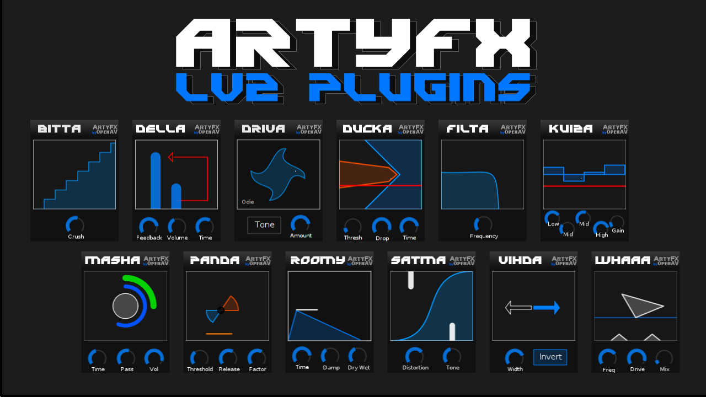

ArtyFX is a growing suite of plugins: right now, the following plugins are
available:
```
- Bitta    (Bitcrusher)
- Della    (Delay)
- Driva    (Guitar Distortion)
- Ducka    (Sidechain envelope)
- Filta    (Low/Hi- pass filter)
- Kuiza    (4- band EQ)
- Masha    (Beat grinder)
- Panda    (Compressor / Expander)
- Roomy    (Smooth reverb)
- Satma    (Crazy distortion)
- Vihda    (Stereo Widener)
```

Bitta
-----
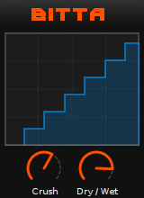
Bitta is a bit-crusher, with a Dry/Wet control.
```
-Crush
-Dry/Wet
```

Crush changes the amount of bits the audio is reduced to, turn it up for more
genuine hip-hop drum crunch.

The Dry/Wet control allows blending of the crushed signal with the original:
useful to maintain punch, but add a nice amount of grit.

Note that bit-crushing is a process that is dependent on the volume of a
signal, so check that your levels are good! Quiet signals are silenced when
bit-crushed!


Della
-----
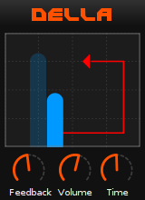
Della is a BPM adjusting delay, with 3 controls:
```
- Feedback
- Volume
- Time
```

Feedback controls the amount of the signal fed back into the delay line: turn
it up to have that reggae-crazy-dub-echo that goes on forever!

Volume changes the amount of the delayed signal you hear: useful to keep the
delays in the background of a track.

Time changes the delay-length: note that this is "quantized" to multiples of
the BPM, so it "jumps" between a 1/8th note, 1/4 note, 1/2 note and whole note
duration. Della picks up the BPM from the host program: so if you change tempo
it will continue to stay in time!


Driva
-----
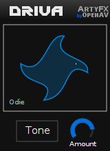
Driva is a multi-distortion unit capable of the most mean and gritty
distortions. Designed for electric guitar, it will also bring to life any synth
sound or drum-loop you want to crunch and give extra energy.

The controls:
```
-Tone
-Amount
```

Click the Tone button to select from list of different distortion models
available. Just click the desired distortion, and keep rocking out. The Cancel
entry at the bottom exits the tone selection menu without change.

Amount just cranks up the gain / distortion quantity. Use at your own peril!


Ducka
-----
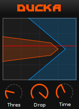
Ducka is a side- chain envelope plugin: it is very useful for creating
"pumping" basslines as often found in minimal house music. The plugin works by
analysing the volume of a sidechain input, and changing the volume of a
separate stereo track, based on the amplitude of the sidechain input.

Eg: if there's a kick-drum on the sidechain input, the volume of the stereo
track gets reduced, until the kickdrum is over, then the stereo track is faded
in again.

The controls:
```
- Threshold
- Drop
- Time
```

Threshold sets the level that the input audio must reach before the stereo
track gets reduced.

The Drop parameter controls the amount of volume reduction that is performed.

Time controls the amount of time it takes before the stereo track is faded in
again. Note that this control is BPM dependent, and the centre is directly on
the off-beats. A setting of half (the default) is generally musical :)


Filta
-----
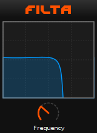
Filta is a lowpass and highpass filter combination. Useful to remove unwanted
high and low frequencies from various recordings or instruments.

The controls:
```
- Frequency
```

Frequency controls what type of filtering is done, and what frequency. Lower
values are lowpass filter, turning up the dial is causes highpass.


Kuiza
-----
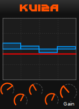
Kuiza is a 4 band equalizer. Its perfect for creatively shaping the sound of an
instrument or synth.

The controls (left to right):
```
- Low gain     (   ~55 Hz)
- Low mid gain (  ~220 Hz)
- High mid gain( ~1760 Hz)
- High gain    ( ~7040 Hz)
- Master gain
```

Each of the gain controls changes the amplitude at the given frequency.
The master gain can be used to reduce or amplify the overall volume if needed.


Masha
-----
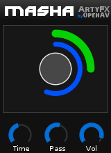
Masha is a beat grinder plugin: it records a segment of audio and plays it
back as a loop, causing a "stutter" effect.

The controls are:
```
- Volume
- PassThru
- Time
```

Volume changes the loudness of the stutter-loop.

PassThru allows bleeding the normal signal trough.

Time is a BPM dependent control that changes the loop-record and playback
length. Gradually reduce this value to get that "standard" DJ stutter effect!

This effect has some special functionality, to allow manual control over the
BPM. Usually the BPM will be taken from the host program (or JACK transport),
but it can now be controlled by a dial.

The "HostBPM" button controls the BPM source. When the button is blue, the
HostBPM is enabled. Turning the button off makes the manual BPM dial appear.
The dial also shows the current BPM.


Panda
-----
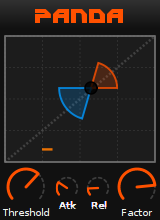
Panda is a compressor expander combo, with attack and release controls.
```
-Threshold
-Attack
-Release
-Factor
```

Threshold: the "turning point" of compression / expansion. Turning down the
dial expands the signal, turning it up causes compression.

Attack affects the speed at which the compression/expansion starts. Generally
low settings sound good, unless you need a long attack.

Release changes the time for Panda to fade-out its compression/expansion.

Factor controls the amount of compression/expansion performed, AKA the
"maximizer" dial.


Roomy
-----
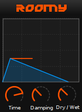
Roomy is a spacious and smooth reverb.

It has three controls:
```
- Time
- Damping
- Dry / Wet
```

The Time control changes the length of the reverb tail: higher values give will
create a bigger and more spacious mix.

Damping controls the high- frequency damping: lower settings gives a spacious
open sound, while a high damping feels small and close.

The Dry/Wet control changes the amount of reverb signal mixed in: useful for
techno and trance "reverb builds"... just crank it right up!


Satma
-----
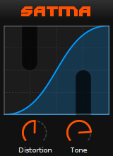
Satma is a crazy distortion plugin. Useful to excite and get gritty, dirty
audio.
```
- Distortion
- Tone
```

Distortion changes the amount of signal-shaping that occurs: the overall amount
of noise production.

The Tone control subtly varies between high-frequencies and lower frequencies,
or making both equally gritty.


Vihda
-----
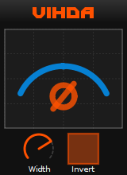
Vihda is a stereo-enhancer, using a mid-side matrix.
```
- Width
- Invert
```

The Width parameter affects the amount of stereo content in the signal. Note
that the the mid-side technique only enhances stereo: it does not create it!

The Invert button inverts the right channel, which can cause a perceptual wider
mix due to how the brain interprets audio. Try it and see if it sounds good.


Outro
------
Do you have a plugin suggestion for ArtyFX? Get in contact with
[OpenAV](http://www.openavproductions.com/contact)!

You can financially support OpenAV and the ArtyFX plugins here:
[Support OpenAV](http://www.openavproductions.com/support)!

I hope you enjoy using these plugins!
  - Harry van Haaren, OpenAV

